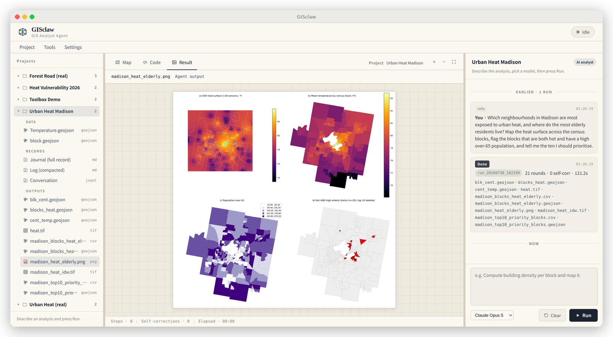
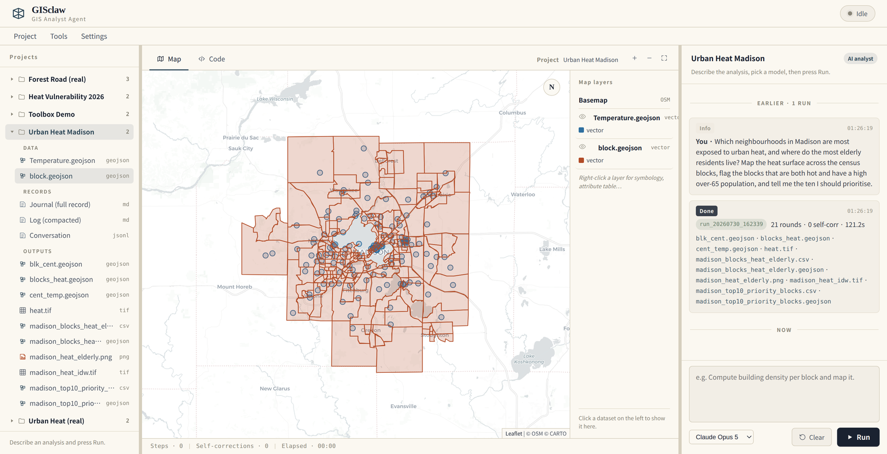
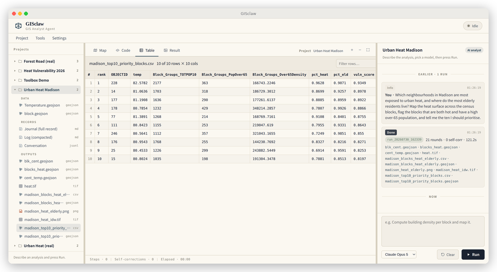
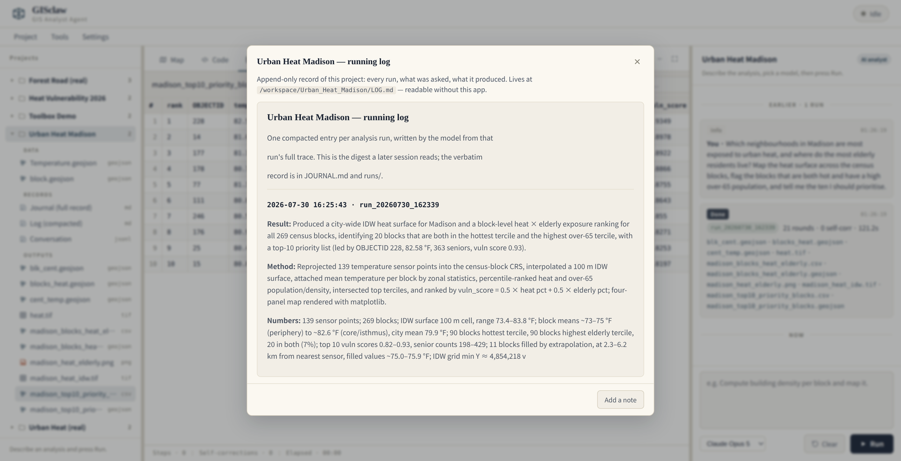
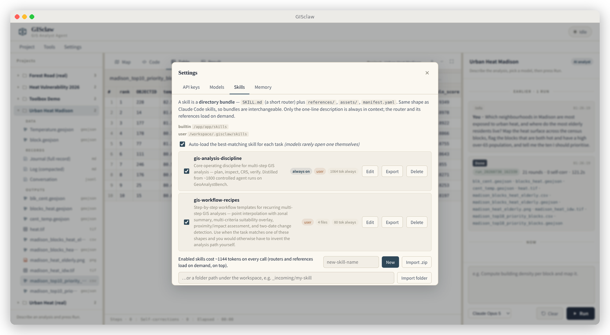
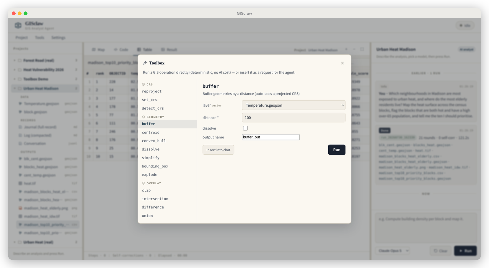
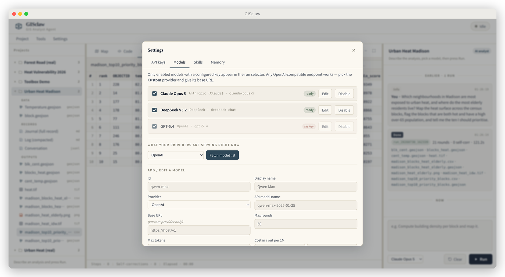

<div align="center">

<h1>GISclaw</h1>

<h3><em>Describe the spatial analysis you need. Get the finished work.</em></h3>

<p>
An automation tool for geospatial analysis. You state the question in ordinary
language — urban heat exposure, flood reach, corridor impact, service coverage —
and GISclaw plans the workflow, runs it against your own data, and returns the
layers, the maps, the tables, and a written account of how it got there.
</p>

<p>
<a href="LICENSE"></a>
<a href="COMMERCIAL-LICENSE.md"></a>
<a href="https://doi.org/10.48550/arXiv.2603.26845"></a>


</p>

<table>
<tr>
<td align="center"><a href="#english"><b>English</b></a></td>
<td align="center"><a href="#中文"><b>中文</b></a></td>
<td align="center"><a href="#한국어"><b>한국어</b></a></td>
<td align="center"><a href="docs/manual/"><b>PDF manual</b></a></td>
</tr>
</table>

</div>

<div align="center">
  
  <p><sub><b>One request, one run.</b> The sentence on the right produced the interpolated heat
  surface, the per-block zonal means, the elderly-population choropleth, and the ranked
  priority blocks — 21 steps, 121 seconds, ten files on disk.</sub></p>
</div>

---

# English

## What it is for

Spatial analysis is mostly a sequence of well-understood operations assembled in
the right order: reproject, interpolate, join, summarise, classify, map. The
assembly is where the hours go — and where the mistakes hide.

GISclaw takes the request in the form a domain scientist would actually say it:

> *"Which neighbourhoods in Madison are most exposed to urban heat, and where do
> the most elderly residents live? Map the heat surface across the census blocks,
> flag the blocks that are both hot and have a high over-65 population, and tell
> me the ten I should prioritise."*

That sentence is the entire input to the run shown above. GISclaw inspected both
layers, noticed they were in different coordinate reference systems, reprojected,
built an IDW heat surface from the 139 sensor readings, computed zonal means for
all 269 census blocks, normalised and combined heat with over-65 density, ranked
the result, drew the four-panel figure, and wrote out ten files — the GeoTIFF
surface, the joined GeoJSON layers, the ranked CSV, and the figure.

Typical requests look like this:

| You say | It produces |
|---|---|
| *"Where would flooding above 2 m cut off access to the hospital?"* | inundation extent, affected road segments, isolated catchment areas |
| *"How much protected forest falls within 500 m of the planned road?"* | buffers, intersections, affected area by protection class, an impact map |
| *"Which districts are underserved by fire stations?"* | service-area buffers, coverage gaps, population inside each gap |
| *"Compare forest cover between these two dates and quantify the loss."* | change raster, gain/loss/net figures, a diverging-scheme map |

## Getting started

```bash
git clone <this repository>
cd GISclaw
docker compose up -d
# open http://localhost:8765
```

Open **Settings → API keys…**, paste a key for whichever provider you use
(OpenAI, Anthropic, DeepSeek, Google, or any OpenAI-compatible endpoint), press
**Test**. Keys are held server-side under `./projects/.gisclaw/` with mode `600`;
they never enter the image, the browser, or this repository.

Then create a project, attach your data, and type what you want.

<div align="center">
  
  <p><sub>Your layers on the map, with the project tree on the left and the conversation on the right.
  Right-click any layer for symbology, attribute table, or zoom.</sub></p>
</div>

## How a run works

GISclaw drives a **ReAct loop** over a persistent Python sandbox: it looks at the
data, reasons about the next step, writes a few lines of code, reads the result,
and continues. You watch it happen in real time — every thought, every action,
every observation, with the code appearing in its own tab as it is written.

The operating discipline is the part that took the longest to get right. It comes
from roughly **1,800 controlled runs** of this agent on real multi-step GIS tasks,
and it is enforced on every analysis:

- **Plan the whole path first.** The common failure is correct code for the wrong
  plan.
- **Read the schema from the data.** Column names are never assumed.
- **Treat CRS as a first-class concern.** Layers in different projections are the
  norm; distance and area work happens in a projected system.
- **Print the null rate after every join.** A silent all-null join is the classic
  disaster that still looks like success.
- **Never fill in missing values quietly.** Units with no measurement stay null.
  If filling is unavoidable, the reason, the count, and a flag column are all
  required, and it must appear in the summary.
- **Check the numbers before finishing.** Ranges, counts, whether the mapped
  field actually varies. An interpolated surface that leaves the observed range
  is a failure, however plausible the file looks.

## What every project keeps

A project is a folder on your disk. Nothing important lives only inside a chat
window.

```
projects/<your project>/
├── data/                     what you attached
├── outputs/                  what came out
├── JOURNAL.md                the full record: every run, every round, verbatim
├── LOG.md                    a compacted digest, one entry per run
├── chat.jsonl                the conversation, rebuilt in the UI on load
└── runs/run_<timestamp>/
    ├── code.py               exactly what was executed
    ├── trace.jsonl           every Thought / Action / Observation
    └── pred_results/         that run's outputs, never overwritten
```

Refresh the browser, restart the container, or come back in three months: the
conversation is still there. Click any past run to **replay** its reasoning and
load the code it ran. `outputs/` is a convenience copy that later runs may
overwrite; `runs/…/pred_results/` never changes, so a specific result is always
reproducible.

<div align="center">
  
  <p><sub>The request, the run summary with its outputs, and the ranked table opened in the viewer.</sub></p>
</div>

## Keeping a months-long project readable

Long projects accumulate transcripts nobody rereads. After each run, GISclaw
spends one model call compressing the whole trace into a five-field entry —
**Result, Method, Numbers, Caveats, Carries forward** — and appends it to
`LOG.md`. That digest is what gets fed back into the next run's context, so the
agent picks up where the project left off without re-reading the transcript.

The caveats field earns its place. From a real entry:

> **Caveats:** No missing data filled and no values imputed — the run is a
> straight read-sort-export of an upstream file. The vulnerability scores
> themselves were not validated, so any issues in how they were originally
> derived carry through unchecked.

<div align="center">
  
</div>

## Different requests, different responses

GISclaw reads what kind of message it received before acting on it, which makes it
usable across the whole arc of a piece of work rather than only at the moment you
already know what to run.

| What you send | What happens |
|---|---|
| A request for analysis | a run starts |
| A question about the project — what was done, what a layer holds, why a value looks odd | answered from the record in a single call |
| An approach you want to think through | discussed: sketch a method, ask what it would do with the data you have, weigh two options, settle the plan before any computation happens |
| Ordinary conversation | stays ordinary |
| Anything outside its scope | declined, with a note about what it does cover |

Discussing a method costs one short call; running it can cost several minutes and
a dollar. Agreeing on the approach first is often the cheaper path to the right
answer.

## Standing preferences

A global `MEMORY.md` holds the conventions that apply to everything you do —
your organisation's colour ramps, the classification scheme you standardise on,
the projected CRS for your region, what every deliverable map must carry. Write
it once in **Settings → Memory…**, or hover any message and press **Remember**.
It is injected into every run.

## Skills: packaging a methodology

A skill is a directory bundle that encodes how a class of analysis should be
done, in a shape compatible with the wider agent-skill ecosystem:

```
<skill>/
├── SKILL.md          YAML frontmatter and a short router
├── manifest.yaml     optional declarative loading plan
└── references/*.md   the depth, opened only when a step calls for it
```

Loading is progressive, which keeps a large library affordable: a one-line
description stays in context permanently (around 80 tokens), the router loads
when the skill becomes relevant, and reference files open one at a time. Bundles
import as a `.zip` or a folder, edit in the app, and export for sharing.

Two ship with the application: **`gis-analysis-discipline`**, the always-on rules
described above, and **`gis-workflow-recipes`**, step-by-step templates for four
recurring shapes — interpolation with zonal summary, multi-criteria suitability
overlay, proximity and impact assessment, and two-date change detection.

<div align="center">
  
</div>

## The operations toolbox

Twenty-eight deterministic geoprocessing operations ship with the application —
reproject, buffer, clip, intersection, difference, union, dissolve, spatial and
attribute joins, zonal statistics, slope, aspect, hillshade, rasterize, IDW, and
more. They exist for two practical reasons: they are tested and CRS-aware, so the
agent reaches for them ahead of writing equivalent code by hand; and when you
already know the exact operation you want, running it directly costs no API call
at all. Results render on the map straight away.

<div align="center">
  
</div>

## Models and keys

Any provider you have a key for. The model list is fetched live from the
provider, so newly released models appear without waiting for an update here, and
only models with a working key are offered in the run selector.

<div align="center">
  
</div>

## Where your data goes

Analysis runs inside the container against your **native** formats — Shapefile,
GeoTIFF, GeoPackage, CSV, NetCDF. Conversion to GeoJSON or PNG happens only in
the browser display layer, since that is what a browser can draw. The files
themselves stay on your machine. What reaches the model provider is your prompt
and the agent's own observations of the data.

## Relationship to the research paper

The system described in [arXiv:2603.26845](https://doi.org/10.48550/arXiv.2603.26845)
is a benchmark harness built for controlled experiments. This desktop application
was rebuilt on top of that agent core and has since diverged substantially.

| | Research system | GISclaw |
|---|---|---|
| Purpose | Controlled benchmark experiments | Day-to-day analysis |
| Interface | Evaluation scripts | Browser application |
| Task input | 50 fixed benchmark tasks | Anything you describe |
| Deterministic operations | — | 28-operation toolbox, agent and UI |
| Persistence | Per-run result directories | Projects, journal, compacted log, replay |
| Skills | Static prompt fragments | Bundles with progressive disclosure |
| Standing preferences | — | Global memory, injected per run |
| Model configuration | Hardcoded in scripts | UI-managed, live discovery |

The experimental results reported in the paper came from the research harness at
its frozen commit. Reproduction work should use that artifact.

## Citation

```bibtex
@article{gisclaw2026,
  title  = {GISclaw: A Comprehensive Open-Source LLM Agent System for
            Realistic Multi-Step Geospatial Analysis},
  author = {Han, Jinzhen and others},
  year   = {2026},
  eprint = {2603.26845},
  doi    = {10.48550/arXiv.2603.26845}
}
```

The bundled example dataset carries its own citation requirement — see
[`examples/urban-heat-madison/README.md`](examples/urban-heat-madison/README.md).

## Licence

Copyright (C) 2026 Han Jinzhen. GISclaw is free software under the
**GNU Affero General Public License v3.0 or later** ([`LICENSE`](LICENSE),
[`COPYRIGHT`](COPYRIGHT)).

Use it for anything, including commercially, at no cost. The one condition: if
you distribute a modified version — **or run one as a network service others
use** (AGPL §13) — you must offer those users your version's complete source
under the AGPL as well. Running it unmodified, or modifying it only for your own
internal use, obliges you to publish nothing.

If that does not work for you — embedding GISclaw in a proprietary product, or
operating a closed-source hosted service — a **commercial licence** is available
from the copyright holder: [`COMMERCIAL-LICENSE.md`](COMMERCIAL-LICENSE.md).
Contributions are covered by [`CONTRIBUTING.md`](CONTRIBUTING.md).

The research code behind the paper stays **MIT** on the `paper-v2` branch and at
tag `v2-gsis-submission`, so published results remain reproducible under the
terms the paper cites. Releases made before 2026-07-31 were MIT and remain so —
this licence change applies to later versions only.

Bundled third-party material — the example dataset (Apache-2.0), Leaflet,
Lucide, OpenStreetMap and CARTO tiles — is listed with its licences in
[`THIRD_PARTY_NOTICES.md`](THIRD_PARTY_NOTICES.md).

<div align="right"><a href="#gisclaw">▲ back to top</a></div>

---

# 中文

## 它解决什么

空间分析大多是一串成熟操作的组合:重投影、插值、连接、统计、分级、出图。真正耗时间的
是**把它们按正确顺序拼起来**,错误也藏在这里。

GISclaw 接受的输入,就是领域科学家平时说话的样子:

> *"Which neighbourhoods in Madison are most exposed to urban heat, and where do
> the most elderly residents live? Map the heat surface across the census blocks,
> flag the blocks that are both hot and have a high over-65 population, and tell
> me the ten I should prioritise."*

上面那张图的全部输入就是这一句话。GISclaw 检查了两个图层,发现坐标系不一致,先做重投影,
用 139 个观测点做 IDW 热力面,对 269 个人口普查街区做分区统计,把温度与 65 岁以上人口
密度归一化后加权合并,排序,画出四联图,最后写出十个文件 —— GeoTIFF 面、连接后的
GeoJSON 图层、排序 CSV 和图件。

常见的请求长这样:

| 你说 | 它产出 |
|---|---|
| *"水位超过 2 米时,哪些路段会切断通往医院的通路?"* | 淹没范围、受影响路段、被孤立的汇水区 |
| *"规划道路 500 米范围内压占了多少保护林?"* | 缓冲区、相交、按保护等级的受影响面积、影响图 |
| *"哪些片区消防服务覆盖不足?"* | 服务半径、覆盖空白、每个空白区内人口 |
| *"对比这两个时相的林地变化并给出损失量。"* | 变化栅格、增加/减少/净变化、发散配色地图 |

## 开始使用

```bash
git clone <本仓库>
cd GISclaw
docker compose up -d
# 打开 http://localhost:8765
```

进入 **Settings → API keys…**,粘贴你所用服务商的 key(OpenAI、Anthropic、DeepSeek、
Google,或任何 OpenAI 兼容端点),点 **Test**。Key 保存在服务端 `./projects/.gisclaw/`
(权限 600),不进镜像、不进浏览器、不进本仓库。

随后新建项目、挂上数据,直接把需求打出来。

<div align="center">
  
  <p><sub>图层在地图上,左侧是项目树,右侧是对话。右键任意图层可改符号化、看属性表、缩放。</sub></p>
</div>

## 一次运行是怎么进行的

GISclaw 在一个持久化 Python 沙箱上跑 **ReAct 循环**:看数据 → 推理下一步 → 写几行代码
→ 读结果 → 继续。全过程实时可见,每一条 Thought / Action / Observation 都在右侧滚动,
代码在自己的标签页里逐段出现。

真正花时间打磨的是**操作纪律**。它来自本 agent 在真实多步 GIS 任务上约 **1800 次受控
实验**,并在每次分析中强制执行:

- **先定完整路径再写代码。** 最常见的失败是"为错误的计划写了正确的代码"。
- **列名从数据里读。** 绝不凭印象硬编码。
- **CRS 是头等问题。** 图层投影不一致是常态;距离和面积运算必须在投影坐标系里做。
- **每次连接后打印 null 率。** 悄无声息的全空连接,是看起来最像成功的经典事故。
- **禁止静默填补缺失值。** 没有观测的单元保持 null。确需填补时,必须给出理由、报告数量、
  加标记列,并在结论里写明。
- **finish 前核对数值。** 值域、计数、上图字段是否真的有变化。插值结果跑出观测区间就是
  失败,哪怕文件看起来很正常。

## 每个项目留下什么

项目就是磁盘上的一个文件夹。重要的东西都不会只存在于对话框里。

```
projects/<你的项目>/
├── data/                     你挂进来的数据
├── outputs/                  产出
├── JOURNAL.md                完整记录:每次运行、每一轮,逐字
├── LOG.md                    压缩摘要,每次运行一条
├── chat.jsonl                对话,打开页面时重建
└── runs/run_<时间戳>/
    ├── code.py               当时实际执行的代码
    ├── trace.jsonl           每一条 Thought / Action / Observation
    └── pred_results/         这次的产物,永不被覆盖
```

刷新浏览器、重启容器、三个月后再来:对话都还在。点任意一次历史运行可**回放**推理过程并
载入当时的代码。`outputs/` 是方便取用的汇总副本,后续运行可能覆盖同名文件;
`runs/…/pred_results/` 永不变动,所以任何一次具体结果都可精确复现。

<div align="center">
  
  <p><sub>提问、带产物清单的运行摘要,以及在查看器里打开的排序表。</sub></p>
</div>

## 让跨月项目依然读得下去

长期项目会堆出没人重读的对话。每次运行结束后,GISclaw 用一次模型调用把整条轨迹压成五段式
条目 —— **Result、Method、Numbers、Caveats、Carries forward** —— 追加进 `LOG.md`。
注入下一次运行上下文的正是这份摘要,agent 因此能直接接上进度,无需重读全文。

其中 Caveats 一段最有价值。这是一条真实产生的记录:

> **Caveats:** 本次未填补任何缺失值、未做插补 —— 只是对上游文件做了读取、排序、导出。
> 脆弱性得分本身未经复核,其原始推导中的任何问题都会原样继承下来。

<div align="center">
  
</div>

## 不同的输入,不同的反应

GISclaw 会先判断收到的是哪一类消息,再决定怎么响应。因此它在一件工作的全过程都用得上,
而不只是在你已经确知要跑什么的那一刻。

| 你发出的 | 它的反应 |
|---|---|
| 分析请求 | 启动一次运行 |
| 关于项目的提问 —— 做过什么、某个图层里有什么、某个值为什么看着不对 | 用一次调用从记录里作答 |
| 想先斟酌的思路 | 展开讨论:描述一个方案、问它面对现有数据会怎么做、比较两种方法的取舍,在任何计算发生之前把路线定下来 |
| 日常对话 | 就当日常对话 |
| 超出范围的请求 | 婉拒,并说明它能处理什么 |

讨论一个方法只需一次短调用;真跑一遍可能要几分钟和一美元。先把路线谈拢,往往是通向
正确答案更省的那条路。

## 常驻偏好

全局 `MEMORY.md` 保存适用于一切工作的约定 —— 单位的配色方案、统一的分级方法、本地区的
投影坐标系、每张交付图必须带的要素。在 **Settings → Memory…** 里写一次,或在任意消息上
悬停点 **Remember**。它会注入每一次运行。

## Skills:把方法论打包

一个 skill 是**目录包**,用来固化某一类分析该怎么做,形态与更广泛的 agent skill 生态一致:

```
<skill>/
├── SKILL.md          YAML frontmatter + 一段简短路由
├── manifest.yaml     可选的声明式加载计划
└── references/*.md   深度内容,只在某一步需要时打开
```

加载是渐进的,因此技能库再大也负担得起:常驻上下文的只有一行描述(约 80 token),命中时
才载入路由,reference 文件按需逐个打开。技能包支持以 `.zip` 或文件夹导入、在应用内编辑、
导出分享。

内置两个:**`gis-analysis-discipline`**(上文那套常驻纪律)和 **`gis-workflow-recipes`**
(四类常见任务的分步模板:插值+分区统计、多准则适宜性叠加、邻近影响评估、两时相变化检测)。

<div align="center">
  
</div>

## 算子工具箱

应用内置 28 个确定性的地理处理算子 —— 重投影、缓冲、裁剪、相交、相减、合并、
融合、空间/属性连接、分区统计、坡度、坡向、山体阴影、栅格化、IDW 等。保留它们有两个很实际
的理由:它们经过测试且正确处理 CRS,agent 会优先调用而不是手写等价代码;当你已经明确知道
要做哪一步时,直接点着跑**完全不产生 API 花费**。结果立即上图。

<div align="center">
  
</div>

## 模型与密钥

支持任何你持有 key 的服务商。模型列表**实时从服务商拉取**,所以新发布的模型无需等本项目
更新即可使用;运行下拉里只会出现确实配好 key 的模型。

<div align="center">
  
</div>

## 你的数据在哪

分析在容器内针对**原生格式**进行 —— Shapefile、GeoTIFF、GeoPackage、CSV、NetCDF。
转成 GeoJSON 或 PNG 只发生在浏览器显示这一层,因为浏览器只能画这些。文件本身始终留在你的
机器上。发送给模型服务商的,是你的提问和 agent 对数据的观察。

## 与研究论文的关系

[arXiv:2603.26845](https://doi.org/10.48550/arXiv.2603.26845) 描述的系统是为受控实验
构建的评测框架。本桌面应用在那套 agent 核心之上重建,此后已有大量分化。

| | 研究系统 | GISclaw |
|---|---|---|
| 目的 | 受控评测实验 | 日常分析工作 |
| 界面 | 评测脚本 | 浏览器应用 |
| 任务来源 | 50 道固定基准题 | 你描述的任何需求 |
| 确定性算子 | — | 28 算子工具箱,agent 与 UI 双通道 |
| 持久化 | 每次运行的结果目录 | 项目、日志、压缩摘要、回放 |
| Skills | 静态提示词片段 | 目录包 + 渐进披露 |
| 常驻偏好 | — | 全局 memory,每次运行注入 |
| 模型配置 | 写死在脚本里 | UI 管理 + 在线发现 |

论文报告的实验结果由研究框架在其冻结 commit 上产生。复现工作应使用那份 artifact。

## 引用

```bibtex
@article{gisclaw2026,
  title  = {GISclaw: A Comprehensive Open-Source LLM Agent System for
            Realistic Multi-Step Geospatial Analysis},
  author = {Han, Jinzhen and others},
  year   = {2026},
  eprint = {2603.26845},
  doi    = {10.48550/arXiv.2603.26845}
}
```

内置示例数据有独立的引用要求,见
[`examples/urban-heat-madison/README.md`](examples/urban-heat-madison/README.md)。

## 许可

Copyright (C) 2026 Han Jinzhen。GISclaw 是自由软件,采用
**GNU Affero 通用公共许可证 v3.0 或更高版本**([`LICENSE`](LICENSE)、[`COPYRIGHT`](COPYRIGHT))。

你可以免费用于任何用途,**包括商业用途**。唯一的条件是:如果你分发修改过的版本,
**或把修改过的版本作为网络服务提供给他人使用**(AGPL 第 13 条),就必须同样以 AGPL
向这些用户提供你那份的完整源码。原样运行、或仅为自己内部使用而修改,不产生任何公开义务。

如果这不适合你 —— 例如要把 GISclaw 嵌入闭源产品,或运营闭源的托管服务 —— 可向著作权人
获取**商业许可**:[`COMMERCIAL-LICENSE.md`](COMMERCIAL-LICENSE.md)。
贡献代码请见 [`CONTRIBUTING.md`](CONTRIBUTING.md)。

论文对应的研究代码仍为 **MIT**,保留在 `paper-v2` 分支与 tag `v2-gsis-submission` 上,
以保证已发表结果可按论文所引用的条款复现。2026-07-31 之前发布的版本为 MIT 且继续有效 ——
本次许可变更仅对之后的版本生效。

内置第三方材料 —— 示例数据(Apache-2.0)、Leaflet、Lucide、OpenStreetMap 与 CARTO 瓦片 ——
的许可见 [`THIRD_PARTY_NOTICES.md`](THIRD_PARTY_NOTICES.md)。

<div align="right"><a href="#gisclaw">▲ 回到顶部</a></div>

---

# 한국어

## 무엇을 위한 도구인가

공간 분석은 대개 잘 정립된 연산의 조합입니다. 재투영, 보간, 조인, 집계, 분류, 지도화.
시간이 드는 지점은 **이들을 올바른 순서로 조립하는 일**이며, 오류도 여기에 숨습니다.

GISclaw는 도메인 연구자가 실제로 말하는 형태의 요청을 그대로 받습니다.

> *"Which neighbourhoods in Madison are most exposed to urban heat, and where do
> the most elderly residents live? Map the heat surface across the census blocks,
> flag the blocks that are both hot and have a high over-65 population, and tell
> me the ten I should prioritise."*

위 그림의 입력은 이 한 문장이 전부입니다. GISclaw는 두 레이어를 확인해 좌표계가 다름을
발견하고 재투영한 뒤, 139개 관측점으로 IDW 열 표면을 만들고, 269개 인구조사 블록의 구역
통계를 계산하고, 온도와 65세 이상 인구밀도를 정규화해 결합·순위화하고, 4패널 그림을 그린 뒤
열 개의 파일을 저장했습니다. GeoTIFF 표면, 조인된 GeoJSON 레이어들, 순위 CSV, 그리고 그림.

일반적인 요청은 다음과 같습니다.

| 사용자의 요청 | 산출물 |
|---|---|
| *"침수 수위 2 m 이상일 때 병원 접근이 차단되는 구간은?"* | 침수 범위, 영향받는 도로 구간, 고립되는 유역 |
| *"계획 도로 500 m 이내에 포함되는 보호림은 얼마인가?"* | 버퍼, 교차, 보호등급별 영향 면적, 영향도 |
| *"소방서 서비스가 부족한 지역은?"* | 서비스 반경, 공백 구역, 공백별 인구 |
| *"두 시점의 산림 피복을 비교하고 손실량을 산출하라."* | 변화 래스터, 증가/감소/순변화, 발산형 배색 지도 |

## 시작하기

```bash
git clone <이 저장소>
cd GISclaw
docker compose up -d
# http://localhost:8765 열기
```

**Settings → API keys…** 에서 사용하는 제공자(OpenAI, Anthropic, DeepSeek, Google 또는
OpenAI 호환 엔드포인트)의 키를 붙여넣고 **Test** 를 누릅니다. 키는 서버 측
`./projects/.gisclaw/` 에 권한 600으로 보관되며, 이미지·브라우저·이 저장소 어디에도
포함되지 않습니다.

이후 프로젝트를 만들고 데이터를 첨부한 뒤, 필요한 작업을 문장으로 입력하면 됩니다.

<div align="center">
  
  <p><sub>지도 위의 레이어, 왼쪽의 프로젝트 트리, 오른쪽의 대화. 레이어를 우클릭하면 심볼 설정,
  속성 테이블, 확대가 제공됩니다.</sub></p>
</div>

## 한 번의 실행이 진행되는 방식

GISclaw는 영속적인 Python 샌드박스 위에서 **ReAct 루프**를 수행합니다. 데이터를 살펴보고,
다음 단계를 추론하고, 몇 줄의 코드를 작성하고, 결과를 읽고, 이어갑니다. 모든 과정이 실시간
으로 보이며, Thought / Action / Observation이 오른쪽에 흐르고 코드는 별도 탭에 순차적으로
나타납니다.

가장 오래 다듬은 부분은 **운영 원칙**입니다. 실제 다단계 GIS 과제에 대한 약 **1,800회의
통제 실행**에서 도출되었으며, 모든 분석에 강제 적용됩니다.

- **코드보다 경로를 먼저 확정한다.** 가장 흔한 실패는 잘못된 계획에 대한 올바른 코드입니다.
- **컬럼명은 데이터에서 읽는다.** 추측으로 하드코딩하지 않습니다.
- **CRS를 최우선으로 다룬다.** 레이어 간 투영 불일치는 일상이며, 거리·면적 연산은 투영
  좌표계에서 수행합니다.
- **조인 후 결측률을 출력한다.** 조용히 전부 NULL이 되는 조인은 성공처럼 보이는 전형적
  사고입니다.
- **결측값을 임의로 채우지 않는다.** 관측이 없는 단위는 NULL로 둡니다. 불가피한 경우 이유,
  개수, 플래그 컬럼을 남기고 요약에도 명시해야 합니다.
- **종료 전 수치를 검증한다.** 값의 범위, 개수, 지도화한 필드가 실제로 변하는지 확인합니다.
  관측 범위를 벗어난 보간 결과는 파일이 멀쩡해 보여도 실패입니다.

## 프로젝트에 남는 것

프로젝트는 디스크상의 폴더입니다. 중요한 것이 대화창 안에만 존재하는 일은 없습니다.

```
projects/<프로젝트>/
├── data/                     첨부한 데이터
├── outputs/                  산출물
├── JOURNAL.md                전체 기록: 모든 실행, 모든 라운드
├── LOG.md                    압축 요약, 실행당 한 항목
├── chat.jsonl                대화 기록, 화면 로드 시 재구성
└── runs/run_<타임스탬프>/
    ├── code.py               실제로 실행된 코드
    ├── trace.jsonl           모든 Thought / Action / Observation
    └── pred_results/         해당 실행의 산출물 (덮어쓰지 않음)
```

새로고침하든, 컨테이너를 재시작하든, 세 달 뒤에 돌아오든 대화는 남아 있습니다. 과거 실행을
클릭하면 추론 과정이 **재생**되고 당시 코드가 불러와집니다. `outputs/` 는 편의를 위한 사본
이라 이후 실행이 같은 이름을 덮어쓸 수 있고, `runs/…/pred_results/` 는 변경되지 않으므로
특정 결과는 항상 재현할 수 있습니다.

<div align="center">
  
</div>

## 몇 달짜리 프로젝트를 계속 읽을 수 있게

장기 프로젝트에는 아무도 다시 읽지 않는 기록이 쌓입니다. 실행이 끝날 때마다 GISclaw는 모델
호출 한 번으로 전체 추적을 다섯 항목 — **Result, Method, Numbers, Caveats,
Carries forward** — 으로 압축해 `LOG.md` 에 추가합니다. 다음 실행의 컨텍스트로 주입되는
것이 이 요약본이므로, 전체 기록을 다시 읽지 않고도 이어서 작업할 수 있습니다.

특히 Caveats 항목이 값을 합니다. 실제 기록의 예시입니다.

> **Caveats:** 결측 데이터를 채우거나 대체하지 않았음 — 상위 파일을 읽고 정렬해 내보낸
> 작업임. 취약성 점수 자체는 검증되지 않았으므로, 원래 도출 과정의 문제는 그대로 이어짐.

<div align="center">
  
</div>

## 요청의 성격에 맞는 응답

GISclaw는 받은 메시지가 어떤 종류인지 먼저 판단한 뒤 행동합니다. 덕분에 실행할 내용을 이미
아는 순간뿐 아니라 작업의 전 과정에서 사용할 수 있습니다.

| 보내는 내용 | 처리 방식 |
|---|---|
| 분석 요청 | 실행을 시작합니다 |
| 프로젝트에 대한 질문 — 무엇을 했는지, 어떤 레이어에 무엇이 있는지, 어떤 값이 왜 이상한지 | 기록을 근거로 한 번의 호출로 답합니다 |
| 검토하고 싶은 접근 방식 | 함께 논의합니다: 방법을 제시하고, 현재 데이터로 무엇을 할지 묻고, 두 선택지를 견주고, 계산이 시작되기 전에 계획을 확정합니다 |
| 일상적인 대화 | 그대로 대화로 처리합니다 |
| 범위를 벗어난 요청 | 정중히 거절하고 처리 가능한 범위를 안내합니다 |

방법을 논의하는 데는 짧은 호출 한 번이면 되지만, 실제로 실행하면 수 분과 1달러가 들 수
있습니다. 먼저 접근 방식에 합의하는 편이 올바른 답에 이르는 더 저렴한 경로인 경우가 많습니다.

## 상시 적용되는 선호

전역 `MEMORY.md` 에는 모든 작업에 적용되는 규약을 둡니다. 기관의 색상 체계, 표준 분류 방식,
해당 지역의 투영 좌표계, 모든 산출 지도에 반드시 포함해야 할 요소 등입니다.
**Settings → Memory…** 에서 한 번 작성하거나, 메시지 위에서 **Remember** 를 누르면 되며,
모든 실행에 주입됩니다.

## Skills: 방법론의 패키징

Skill은 특정 유형의 분석을 어떻게 수행할지 담은 **디렉터리 번들**이며, 넓은 의미의 에이전트
스킬 생태계와 형태가 호환됩니다.

```
<skill>/
├── SKILL.md          YAML frontmatter와 짧은 라우터
├── manifest.yaml     선택적 선언형 로딩 계획
└── references/*.md   해당 단계에서 필요할 때만 열리는 상세 자료
```

로딩이 점진적이어서 라이브러리가 커져도 부담이 적습니다. 한 줄 설명만 상시 컨텍스트에
남고(약 80 토큰), 관련될 때 라우터가 로드되며, 참조 파일은 하나씩 열립니다. 번들은 `.zip`
또는 폴더로 가져오고, 앱에서 편집하고, 내보내어 공유할 수 있습니다.

기본 제공은 두 가지입니다. 위에서 설명한 상시 원칙인 **`gis-analysis-discipline`**, 그리고
반복되는 네 유형(보간과 구역 통계, 다기준 적합도 중첩, 근접·영향 평가, 두 시점 변화 탐지)의
단계별 템플릿인 **`gis-workflow-recipes`** 입니다.

<div align="center">
  
</div>

## 연산 도구 상자

재투영, 버퍼, 클립, 교차, 차집합, 합집합, 디졸브, 공간·속성 조인, 구역 통계, 경사, 향,
음영기복, 래스터화, IDW 등 **28개의 결정적 지오프로세싱 연산**이 함께 제공됩니다.
두 가지 실용적 이유가 있습니다. 검증되어 있고 CRS를 올바르게 처리하므로 에이전트가 동등한
코드를 직접 작성하기보다 이 연산들을 먼저 사용하며, 필요한 단계를 이미 알고 있을 때는 직접
실행하면 **API 비용이 전혀 들지 않습니다**. 결과는 즉시 지도에 표시됩니다.

<div align="center">
  
</div>

## 모델과 키

키를 보유한 어떤 제공자든 사용할 수 있습니다. 모델 목록은 제공자로부터 **실시간으로**
가져오므로 새로 출시된 모델도 본 저장소의 업데이트를 기다릴 필요가 없으며, 키가 정상 동작하는
모델만 실행 선택기에 표시됩니다.

<div align="center">
  
</div>

## 데이터의 위치

분석은 컨테이너 안에서 **원본 형식**(Shapefile, GeoTIFF, GeoPackage, CSV, NetCDF)을
대상으로 수행됩니다. GeoJSON이나 PNG로의 변환은 브라우저 표시 계층에서만 일어납니다. 파일
자체는 사용자의 컴퓨터에 남습니다. 모델 제공자에게 전달되는 것은 프롬프트와 에이전트가 데이터
에 대해 관찰한 내용입니다.

## 연구 논문과의 관계

[arXiv:2603.26845](https://doi.org/10.48550/arXiv.2603.26845) 에 기술된 시스템은 통제된
실험을 위한 벤치마크 하네스입니다. 본 데스크톱 애플리케이션은 그 에이전트 코어 위에서 다시
구축되었으며 이후 상당히 분화했습니다.

| | 연구 시스템 | GISclaw |
|---|---|---|
| 목적 | 통제된 벤치마크 실험 | 일상적인 분석 업무 |
| 인터페이스 | 평가 스크립트 | 브라우저 애플리케이션 |
| 작업 입력 | 고정된 50개 과제 | 사용자가 설명하는 모든 것 |
| 결정적 연산 | — | 28개 연산 도구 상자 (에이전트·UI) |
| 영속성 | 실행별 결과 디렉터리 | 프로젝트, 저널, 압축 로그, 재생 |
| Skills | 정적 프롬프트 조각 | 점진적 공개를 갖춘 번들 |
| 상시 선호 | — | 실행마다 주입되는 전역 메모리 |
| 모델 설정 | 스크립트에 하드코딩 | UI 관리 및 실시간 탐색 |

논문에 보고된 실험 결과는 고정된 커밋의 연구용 하네스에서 생성되었습니다. 재현 작업에는 해당
아티팩트를 사용하십시오.

## 인용

```bibtex
@article{gisclaw2026,
  title  = {GISclaw: A Comprehensive Open-Source LLM Agent System for
            Realistic Multi-Step Geospatial Analysis},
  author = {Han, Jinzhen and others},
  year   = {2026},
  eprint = {2603.26845},
  doi    = {10.48550/arXiv.2603.26845}
}
```

기본 제공 예제 데이터에는 별도의 인용 요건이 있습니다 —
[`examples/urban-heat-madison/README.md`](examples/urban-heat-madison/README.md) 참조.

## 라이선스

Copyright (C) 2026 Han Jinzhen. GISclaw는 **GNU Affero General Public License
v3.0 이상**([`LICENSE`](LICENSE), [`COPYRIGHT`](COPYRIGHT))으로 배포되는 자유
소프트웨어입니다.

**상업적 이용을 포함하여** 어떤 목적으로든 무료로 사용할 수 있습니다. 조건은 하나입니다.
수정한 버전을 배포하거나, **수정한 버전을 네트워크 서비스로 제공하는 경우**(AGPL 제13조),
해당 사용자에게 그 버전의 완전한 소스를 동일하게 AGPL로 제공해야 합니다. 수정 없이
실행하거나 내부 용도로만 수정하는 경우에는 공개 의무가 발생하지 않습니다.

이 조건을 수용하기 어려운 경우 — 예를 들어 GISclaw를 독점 제품에 내장하거나 비공개
호스팅 서비스로 운영하려는 경우 — 저작권자로부터 **상용 라이선스**를 받을 수 있습니다:
[`COMMERCIAL-LICENSE.md`](COMMERCIAL-LICENSE.md). 기여는
[`CONTRIBUTING.md`](CONTRIBUTING.md)를 참조하십시오.

논문에 해당하는 연구 코드는 `paper-v2` 브랜치와 태그 `v2-gsis-submission`에서 **MIT**로
유지되어, 발표된 결과가 논문이 인용한 조건 그대로 재현 가능합니다. 2026-07-31 이전에
공개된 릴리스는 MIT이며 그대로 유효합니다 — 이번 라이선스 변경은 이후 버전에만
적용됩니다.

포함된 서드파티 자료 — 예제 데이터셋(Apache-2.0), Leaflet, Lucide, OpenStreetMap 및
CARTO 타일 — 의 라이선스는 [`THIRD_PARTY_NOTICES.md`](THIRD_PARTY_NOTICES.md) 에
정리되어 있습니다.

<div align="right"><a href="#gisclaw">▲ 맨 위로</a></div>
