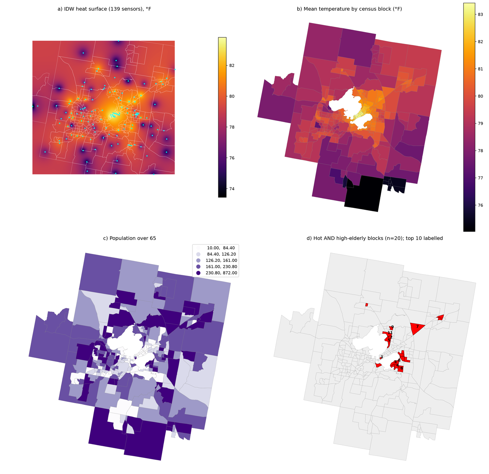

<div align="center">

<h1>GISclaw</h1>

<h3><em>Describe the spatial analysis you need. Get the finished work.</em></h3>

<p>
A desktop application for geospatial analysis. You state the question in ordinary
language — urban heat exposure, flood reach, corridor impact, service coverage —
and GISclaw plans the workflow, runs it against your own data, and returns the
layers, the maps, the tables, and a written account of how it got there.
</p>

<p>
<a href="https://github.com/geumjin99/GISclaw/releases/latest"></a>
<a href="LICENSE"></a>
<a href="COMMERCIAL-LICENSE.md"></a>
<a href="https://doi.org/10.48550/arXiv.2603.26845"></a>
</p>

<table>
<tr>
<td align="center"><a href="#english"><b>English</b></a></td>
<td align="center"><a href="#中文"><b>中文</b></a></td>
<td align="center"><a href="#한국어"><b>한국어</b></a></td>
</tr>
</table>

</div>

<div align="center">
  
  <p><sub>Produced from one sentence — <i>"Compare the mean surface temperature of each block with the city average and map where the heat concentrates."</i> — along with the layers and tables behind it.</sub></p>
</div>

---

<a id="english"></a>
## English

### Install

Download the build for your system from the
[**Releases page**](https://github.com/geumjin99/GISclaw/releases/latest):

| | File | Then |
|---|---|---|
| **macOS** (Apple Silicon) | `GISclaw-<version>-macos-arm64.dmg` | Open it, drag **GISclaw** to *Applications*. The first time, open it with **right-click → Open** (on macOS 15: *System Settings → Privacy & Security → Open Anyway*), because the build is not signed with a developer certificate. |
| **Windows** (64-bit) | `GISclaw-<version>-windows-x64-setup.exe` | Run it; it installs under your user account, no administrator needed, and puts GISclaw in the Start menu. If SmartScreen appears: **More info → Run anyway**. |

GISclaw opens in its own window. Everything you make — projects, data,
outputs, run history, the keys you enter — lives in your user data folder
(`~/Library/Application Support/GISclaw` on macOS, `%LOCALAPPDATA%\GISclaw`
on Windows), never inside the program, so updating means installing the new
version over the old one.

The interface is available in **English, 中文 and 한국어** — the language button
at the right end of the menu bar switches it, and the choice is remembered.

### First run

1. **A model.** Open *Settings → API keys*, paste a key for the provider you
   use — OpenAI, Anthropic, DeepSeek, Google, or any OpenAI-compatible
   endpoint — and press **Test**. Keys are stored on this computer only.
   Prefer to keep everything on your own hardware? Open *Settings → Local
   models*, pick Ollama, LM Studio or vLLM, press **Connect**, and add a model
   from what the server is serving. Nothing is sent to a provider and nothing is
   billed. The panel shows each model's size and context length and warns when
   the context is too small for a run — the usual reason a local model
   "goes quiet".
2. **A project.** *Project → New project*, then *Add data*: pick files from
   anywhere on your computer, or drag them in. Shapefile, GeoJSON, GeoPackage,
   GeoTIFF, CSV, NetCDF — native formats, read as they are.
3. **The question.** Type what you want in the box on the right and press
   **Run**. Watch the reasoning unfold, or fold it away and wait for the answer.

<div align="center">
  
  <p><sub>Your layers on the map, the project tree on the left, the conversation on the right. Right-click a layer for symbology, attribute table or zoom.</sub></p>
</div>

### How a run works

The agent works in rounds. It reads the data before touching it — feature
counts, geometry types, coordinate systems, the actual column names — then
plans the whole path, and only then computes. Standard operations (reproject,
buffer, clip, overlay, joins, zonal statistics, terrain, interpolation) go
through a toolbox of **28 deterministic operations**; code is written only for
what no operation covers. Before finishing it checks the numbers: plausible
counts, values inside the observed range, a join that actually matched.

Every run leaves the executed code, the full trace and the outputs on disk.
**Stop** interrupts a run mid-step; a run in progress carries on if you close
the window and is there again when you reopen it.

<div align="center">
  
</div>

### What a project keeps

- **Conversation** and a **journal** — every run, what was asked, what came out.
- A **compacted log**, one paragraph per run written by the model, fed back
  to the agent so a months-old project keeps its context.
- **Replay** of any earlier run, with its code.
- Archive, export as zip, rename, delete — from the project's right-click menu.

<div align="center">
  
</div>

### The toolbox

The same 28 operations the agent uses, in a dialog: pick inputs from the
project, set parameters, **Run** it directly at no API cost — or **Insert into
chat** to hand it to the agent as part of a larger request.

<div align="center">
  
</div>

### Skills and standing preferences

A **skill** is a folder — `SKILL.md` plus reference files — that gives the agent
a methodology. Two are built in: an operating discipline distilled from about
1,800 controlled runs, and workflow recipes for common analyses. Import your
own; bundles use the same layout as Claude Code skills. **Memory** holds the
preferences that apply to every project — house coordinate system, map
conventions, deliverable rules.

<div align="center">
  
</div>

### The map

*Settings → Map* chooses the basemap: Esri street, topographic or imagery and
OpenTopoMap without a key; MapTiler, Mapbox or Thunderforest with one; any XYZ
template of your own; an **MBTiles** file for fully offline work; or none. Tiles
are fetched by GISclaw and kept in the data folder, so a key never reaches the
page and areas you have viewed stay available offline. A built-in Natural Earth
layer is always drawn underneath.

### Docker, and from source

The same application runs as a container, which keeps the model's code away
from the rest of your machine:

```bash
git clone https://github.com/geumjin99/GISclaw.git && cd GISclaw
docker compose up -d        # then open http://localhost:8765
```

From a checkout, `bash install.sh` (macOS, Linux) or
`powershell -ExecutionPolicy Bypass -File install.ps1` (Windows) builds the
desktop application beside the source; `desktop/build_macos.sh` and
`desktop/build_windows.ps1` produce the installers. `pytest -q tests` runs the
test suite.

### Relationship to the research paper

The system in [arXiv:2603.26845](https://doi.org/10.48550/arXiv.2603.26845) is
a benchmark harness for controlled experiments; this application was rebuilt on
its agent core and has diverged substantially since. The results in the paper
came from the harness at its frozen commit, kept on the `paper-v2` branch (tag
`v2-gsis-submission`); reproduction work should use that artifact.

```bibtex
@article{gisclaw2026,
  title  = {GISclaw: A Comprehensive Open-Source LLM Agent System for
            Realistic Multi-Step Geospatial Analysis},
  author = {Han, Jinzhen and others},
  year   = {2026},
  eprint = {2603.26845},
  doi    = {10.48550/arXiv.2603.26845}
}
```

The bundled example dataset carries its own citation requirement — see
[`examples/urban-heat-madison/README.md`](examples/urban-heat-madison/README.md).

### Before you rely on it

GISclaw plans and writes its own analysis code, and that planning comes from a
language model. It can be wrong, and it can be wrong while sounding confident.
The built-in discipline reduces the classic failures but does not eliminate
them. Every run leaves its code and trace on disk so the work can be checked —
check it, and treat the output as a draft for expert review rather than a
finding. With a hosted model, a description of your data leaves your machine;
with a local model, nothing does. Installed as a desktop application, the
model's code runs with your own permissions. The full text is in
[`DISCLAIMER.md`](DISCLAIMER.md).

### Licence

Copyright (C) 2026 Han Jinzhen. GISclaw is free software under the
**GNU Affero General Public License v3.0 or later** ([`LICENSE`](LICENSE),
[`COPYRIGHT`](COPYRIGHT)). Use it for anything, including commercially, at no
cost; if you distribute a modified version, or run one as a network service
others use, offer those users its source under the same licence. A
**commercial licence** for other arrangements is available from the copyright
holder: [`COMMERCIAL-LICENSE.md`](COMMERCIAL-LICENSE.md).

---

<a id="中文"></a>
## 中文

### 安装

从 [**Releases 页面**](https://github.com/geumjin99/GISclaw/releases/latest) 下载对应系统的安装包：

| | 文件 | 然后 |
|---|---|---|
| **macOS**（Apple Silicon） | `GISclaw-<版本>-macos-arm64.dmg` | 打开后把 **GISclaw** 拖到「应用程序」。第一次启动请**右键 → 打开**（macOS 15：系统设置 → 隐私与安全性 → 仍要打开），因为安装包没有开发者证书签名。 |
| **Windows**（64 位） | `GISclaw-<版本>-windows-x64-setup.exe` | 双击运行，安装在当前用户目录下，不需要管理员权限，开始菜单里会出现 GISclaw。若出现 SmartScreen 提示：**更多信息 → 仍要运行**。 |

GISclaw 在自己的窗口中打开。你产生的一切——项目、数据、产出、运行历史、填入的密钥——都存放在用户数据目录（macOS 为 `~/Library/Application Support/GISclaw`，Windows 为 `%LOCALAPPDATA%\GISclaw`），不在程序内部，所以升级就是直接覆盖安装新版本。

界面提供 **English、中文、한국어** 三种语言——菜单栏最右端的语言按钮可切换，选择会被记住。

### 第一次使用

1. **模型。** 打开「设置 → API 密钥」，粘贴你所用提供商的密钥——OpenAI、Anthropic、DeepSeek、Google 或任何 OpenAI 兼容端点——按**测试**。密钥只保存在本机。
   想让一切留在自己的硬件上？打开「设置 → 本地模型」，选择 Ollama、LM Studio 或 vLLM，按**连接**，从服务器提供的模型里加入一个。不向任何服务商发送数据，也不产生费用。面板会显示每个模型的大小和上下文长度，并在上下文太小、不够跑一次分析时给出提示——这是本地模型"变傻"最常见的原因。
2. **项目。**「项目 → 新建项目」，然后「添加数据」：从电脑任意位置选文件，或直接拖进来。Shapefile、GeoJSON、GeoPackage、GeoTIFF、CSV、NetCDF——原生格式，原样读取。
3. **提问。** 在右侧输入框写下你要做的分析，按**运行**。可以看着推理过程展开，也可以折起来只等结果。

<div align="center">
  
  <p><sub>图层在地图上，项目树在左，对话在右。右键图层可设置符号、查看属性表或缩放。</sub></p>
</div>

### 一次运行是怎么进行的

助手按轮次工作。动手之前先读数据——要素数、几何类型、坐标系、真实的字段名——然后规划完整路径，之后才开始计算。标准操作（重投影、缓冲、裁剪、叠加、连接、分区统计、地形、插值）走 **28 个确定性算子**组成的工具箱；只有算子不覆盖的部分才写代码。结束前它会核对数字：要素数是否合理、数值是否落在观测范围内、连接是否真的匹配上了。

每次运行都会把执行过的代码、完整轨迹和产出留在磁盘上。**停止**可以在任意一步打断运行；关掉窗口时正在进行的运行不会中断，重新打开会接着显示。

<div align="center">
  
</div>

### 每个项目留下什么

- **对话**和**实验记录**——每次运行、提了什么、出了什么。
- **摘要日志**，每次运行由模型写一段，回灌给助手，几个月前的项目依然有上下文。
- 任意一次历史运行可**回放**，连同代码。
- 归档、导出为 zip、重命名、删除——都在项目的右键菜单里。

<div align="center">
  
</div>

### 工具箱

助手用的那 28 个算子，在一个对话框里：从项目中选输入，设参数，**运行**——不花 API 费用；或者**插入对话**，作为更大请求的一部分交给助手。

<div align="center">
  
</div>

### Skills 与常驻偏好

**Skill** 是一个文件夹——`SKILL.md` 加参考文件——给助手一套方法论。内置两个：从约 1,800 次受控实验中提炼的操作纪律，以及常见分析的流程模板。也可以导入你自己的；包结构与 Claude Code 的 skill 相同。**记忆**存放适用于所有项目的偏好——常用坐标系、制图规范、交付要求。

<div align="center">
  
</div>

### 地图

「设置 → 地图」选择底图：Esri 街道 / 地形 / 卫星影像和 OpenTopoMap 免 key；MapTiler、Mapbox、Thunderforest 填 key；任何自定义 XYZ 模板；**MBTiles** 文件用于完全离线；或者不用底图。瓦片由 GISclaw 获取并保存在数据目录里，密钥不会进入页面，看过的区域断网后仍可显示。内置的 Natural Earth 图层始终绘制在最底层。

### Docker 与源码

同一个应用也可以作为容器运行，让模型写的代码与你机器上的其他内容隔离：

```bash
git clone https://github.com/geumjin99/GISclaw.git && cd GISclaw
docker compose up -d        # 然后打开 http://localhost:8765
```

在源码目录里，`bash install.sh`（macOS、Linux）或 `powershell -ExecutionPolicy Bypass -File install.ps1`（Windows）会在源码旁边构建桌面应用；`desktop/build_macos.sh` 与 `desktop/build_windows.ps1` 生成安装包；`pytest -q tests` 运行测试。

### 与研究论文的关系

[arXiv:2603.26845](https://doi.org/10.48550/arXiv.2603.26845) 中的系统是用于受控实验的基准评测框架；本应用在其 agent 内核上重建，此后已有很大不同。论文中的结果来自该框架的冻结版本，保存在 `paper-v2` 分支（tag `v2-gsis-submission`）；复现工作请使用那份代码。引用格式见上方英文部分。

自带的示例数据有其自身的引用要求，见 [`examples/urban-heat-madison/README.md`](examples/urban-heat-madison/README.md)。

### 在依赖结果之前

GISclaw 自行规划并编写分析代码，而规划来自语言模型。它可能出错，而且可能语气肯定地出错。内置纪律能减少典型失败，但不能消除。每次运行的代码和轨迹都留在磁盘上，可以核查——请核查，并把产出当作供专业复核的草稿而不是结论。使用云端模型时，你的数据描述会离开本机；使用本地模型则不会。以桌面应用方式安装时，模型的代码以你的权限运行。全文见 [`DISCLAIMER.md`](DISCLAIMER.md)。

### 许可

版权 (C) 2026 Han Jinzhen。GISclaw 是 **GNU Affero 通用公共许可证 v3.0 或更高版本**下的自由软件（[`LICENSE`](LICENSE)、[`COPYRIGHT`](COPYRIGHT)）。可免费用于任何目的，包括商业用途；若分发修改版本，或把修改版本作为网络服务供他人使用，须以同一许可证向这些用户提供源码。其他安排可向版权持有人获取**商业许可**：[`COMMERCIAL-LICENSE.md`](COMMERCIAL-LICENSE.md)。

---

<a id="한국어"></a>
## 한국어

### 설치

[**Releases 페이지**](https://github.com/geumjin99/GISclaw/releases/latest)에서 시스템에 맞는 파일을 내려받습니다:

| | 파일 | 그다음 |
|---|---|---|
| **macOS** (Apple Silicon) | `GISclaw-<버전>-macos-arm64.dmg` | 열어서 **GISclaw**를 *응용 프로그램*으로 끌어다 놓습니다. 처음 실행할 때는 **오른쪽 클릭 → 열기**(macOS 15: *시스템 설정 → 개인정보 보호 및 보안 → 그래도 열기*)로 여세요. 개발자 인증서로 서명되지 않은 빌드이기 때문입니다. |
| **Windows** (64비트) | `GISclaw-<버전>-windows-x64-setup.exe` | 실행하면 사용자 계정 아래에 설치되며 관리자 권한이 필요 없고, 시작 메뉴에 GISclaw가 생깁니다. SmartScreen이 뜨면 **추가 정보 → 실행**을 누르세요. |

GISclaw는 자체 창으로 열립니다. 만든 것 전부 — 프로젝트, 데이터, 산출물, 실행 기록, 입력한 키 — 는 사용자 데이터 폴더(macOS `~/Library/Application Support/GISclaw`, Windows `%LOCALAPPDATA%\GISclaw`)에 있고 프로그램 안에는 없으므로, 업데이트는 새 버전을 덮어 설치하면 됩니다.

인터페이스는 **English, 中文, 한국어**를 지원합니다. 메뉴 막대 오른쪽 끝의 언어 버튼으로 바꾸며, 선택은 기억됩니다.

### 처음 실행

1. **모델.** *설정 → API 키*에서 사용하는 제공자의 키 — OpenAI, Anthropic, DeepSeek, Google, 또는 OpenAI 호환 엔드포인트 — 를 붙여넣고 **테스트**를 누릅니다. 키는 이 컴퓨터에만 저장됩니다.
   모든 것을 내 하드웨어에 두고 싶다면 *설정 → 로컬 모델*에서 Ollama, LM Studio, vLLM 중 하나를 고르고 **연결**을 누른 뒤 서버가 제공하는 모델을 추가하세요. 제공자에게 아무것도 보내지 않고 요금도 없습니다. 이 패널은 각 모델의 크기와 컨텍스트 길이를 보여 주고, 한 번의 실행에 부족할 만큼 컨텍스트가 작으면 경고합니다 — 로컬 모델이 "말이 없어지는" 가장 흔한 이유입니다.
2. **프로젝트.** *프로젝트 → 새 프로젝트*, 그다음 *데이터 추가*: 컴퓨터 어디서든 파일을 고르거나 끌어다 놓습니다. Shapefile, GeoJSON, GeoPackage, GeoTIFF, CSV, NetCDF — 원본 형식 그대로 읽습니다.
3. **질문.** 오른쪽 입력창에 원하는 분석을 적고 **실행**을 누릅니다. 추론이 펼쳐지는 것을 지켜보거나, 접어 두고 답만 기다리세요.

<div align="center">
  
  <p><sub>지도 위의 레이어, 왼쪽의 프로젝트 트리, 오른쪽의 대화. 레이어를 오른쪽 클릭하면 심볼, 속성 테이블, 확대를 열 수 있습니다.</sub></p>
</div>

### 실행은 이렇게 진행됩니다

에이전트는 라운드 단위로 일합니다. 손대기 전에 데이터를 읽고 — 피처 수, 도형 유형, 좌표계, 실제 열 이름 — 전체 경로를 계획한 뒤에야 계산합니다. 표준 작업(재투영, 버퍼, 클립, 오버레이, 조인, 존 통계, 지형, 보간)은 **28개의 결정적 연산**으로 이루어진 도구 상자를 거치고, 어떤 연산도 다루지 않는 부분에만 코드를 씁니다. 끝내기 전에 숫자를 점검합니다: 그럴듯한 개수인지, 값이 관측 범위 안에 있는지, 조인이 실제로 맞았는지.

모든 실행은 실행된 코드, 전체 추적, 산출물을 디스크에 남깁니다. **중지**는 실행을 단계 중간에 끊고, 창을 닫아도 진행 중인 실행은 계속되며 다시 열면 그 자리에 있습니다.

<div align="center">
  
</div>

### 프로젝트가 남기는 것

- **대화**와 **저널** — 모든 실행, 무엇을 물었고 무엇이 나왔는지.
- **요약 로그** — 실행마다 모델이 쓴 한 단락이 에이전트에게 다시 주어져, 몇 달 된 프로젝트도 맥락을 유지합니다.
- 이전 실행의 **재생**, 코드와 함께.
- 보관, zip으로 내보내기, 이름 바꾸기, 삭제 — 프로젝트의 오른쪽 클릭 메뉴에서.

<div align="center">
  
</div>

### 도구 상자

에이전트가 쓰는 28개 연산을 대화 상자에서: 프로젝트에서 입력을 고르고 매개변수를 정한 뒤 **실행**하면 API 비용 없이 바로 돌아가고, **대화에 넣기**를 누르면 더 큰 요청의 일부로 에이전트에게 넘어갑니다.

<div align="center">
  
</div>

### 스킬과 상시 선호

**스킬**은 폴더 — `SKILL.md`와 참고 파일 — 로, 에이전트에게 방법론을 줍니다. 두 개가 내장되어 있습니다: 약 1,800회의 통제 실험에서 추출한 작업 규율, 그리고 흔한 분석의 워크플로 레시피. 직접 만든 것도 가져올 수 있으며 번들 구조는 Claude Code 스킬과 같습니다. **메모리**에는 모든 프로젝트에 적용되는 선호 — 기본 좌표계, 지도 규칙, 산출물 규칙 — 를 둡니다.

<div align="center">
  
</div>

### 지도

*설정 → 지도*에서 배경 지도를 고릅니다: Esri 도로·지형·위성 영상과 OpenTopoMap은 키 없이; MapTiler, Mapbox, Thunderforest는 키로; 직접 정한 XYZ 템플릿; 완전 오프라인용 **MBTiles** 파일; 또는 없음. 타일은 GISclaw가 가져와 데이터 폴더에 보관하므로 키가 페이지에 닿지 않고, 본 지역은 오프라인에서도 볼 수 있습니다. 내장 Natural Earth 레이어가 항상 아래에 그려집니다.

### Docker, 그리고 소스에서

같은 애플리케이션을 컨테이너로도 실행할 수 있으며, 그러면 모델의 코드가 컴퓨터의 나머지와 격리됩니다:

```bash
git clone https://github.com/geumjin99/GISclaw.git && cd GISclaw
docker compose up -d        # 그다음 http://localhost:8765 을 엽니다
```

소스 폴더에서 `bash install.sh`(macOS, Linux) 또는 `powershell -ExecutionPolicy Bypass -File install.ps1`(Windows)는 소스 옆에 데스크톱 앱을 만들고, `desktop/build_macos.sh`와 `desktop/build_windows.ps1`는 설치 파일을 만듭니다. `pytest -q tests`는 테스트를 실행합니다.

### 연구 논문과의 관계

[arXiv:2603.26845](https://doi.org/10.48550/arXiv.2603.26845)의 시스템은 통제 실험을 위한 벤치마크 하니스이고, 이 애플리케이션은 그 에이전트 코어 위에 다시 만들어져 이후 크게 달라졌습니다. 논문의 결과는 고정된 커밋의 하니스에서 나왔으며 `paper-v2` 브랜치(태그 `v2-gsis-submission`)에 보존되어 있습니다. 재현 작업은 그 산출물을 쓰세요. 인용 형식은 위 영어 절에 있습니다.

함께 제공되는 예제 데이터에는 별도의 인용 요건이 있습니다 — [`examples/urban-heat-madison/README.md`](examples/urban-heat-madison/README.md).

### 결과를 믿기 전에

GISclaw는 분석 코드를 스스로 계획하고 작성하며, 그 계획은 언어 모델에서 나옵니다. 틀릴 수 있고, 자신 있게 틀릴 수도 있습니다. 내장 규율은 전형적인 실패를 줄이지만 없애지는 못합니다. 모든 실행은 코드와 추적을 디스크에 남기므로 검토할 수 있습니다 — 검토하고, 산출물을 결론이 아니라 전문가 검토용 초안으로 다루세요. 호스팅 모델을 쓰면 데이터에 대한 설명이 컴퓨터 밖으로 나가고, 로컬 모델을 쓰면 아무것도 나가지 않습니다. 데스크톱 앱으로 설치하면 모델의 코드가 내 권한으로 실행됩니다. 전문은 [`DISCLAIMER.md`](DISCLAIMER.md)에 있습니다.

### 라이선스

저작권 (C) 2026 Han Jinzhen. GISclaw는 **GNU Affero General Public License v3.0 이상**의 자유 소프트웨어입니다([`LICENSE`](LICENSE), [`COPYRIGHT`](COPYRIGHT)). 상업적 용도를 포함해 무엇에든 무료로 쓸 수 있습니다. 수정한 버전을 배포하거나 다른 사람이 쓰는 네트워크 서비스로 운영한다면, 그 사용자에게 같은 라이선스로 소스를 제공해야 합니다. 다른 방식이 필요하면 저작권자에게 **상업 라이선스**를 받을 수 있습니다: [`COMMERCIAL-LICENSE.md`](COMMERCIAL-LICENSE.md).
